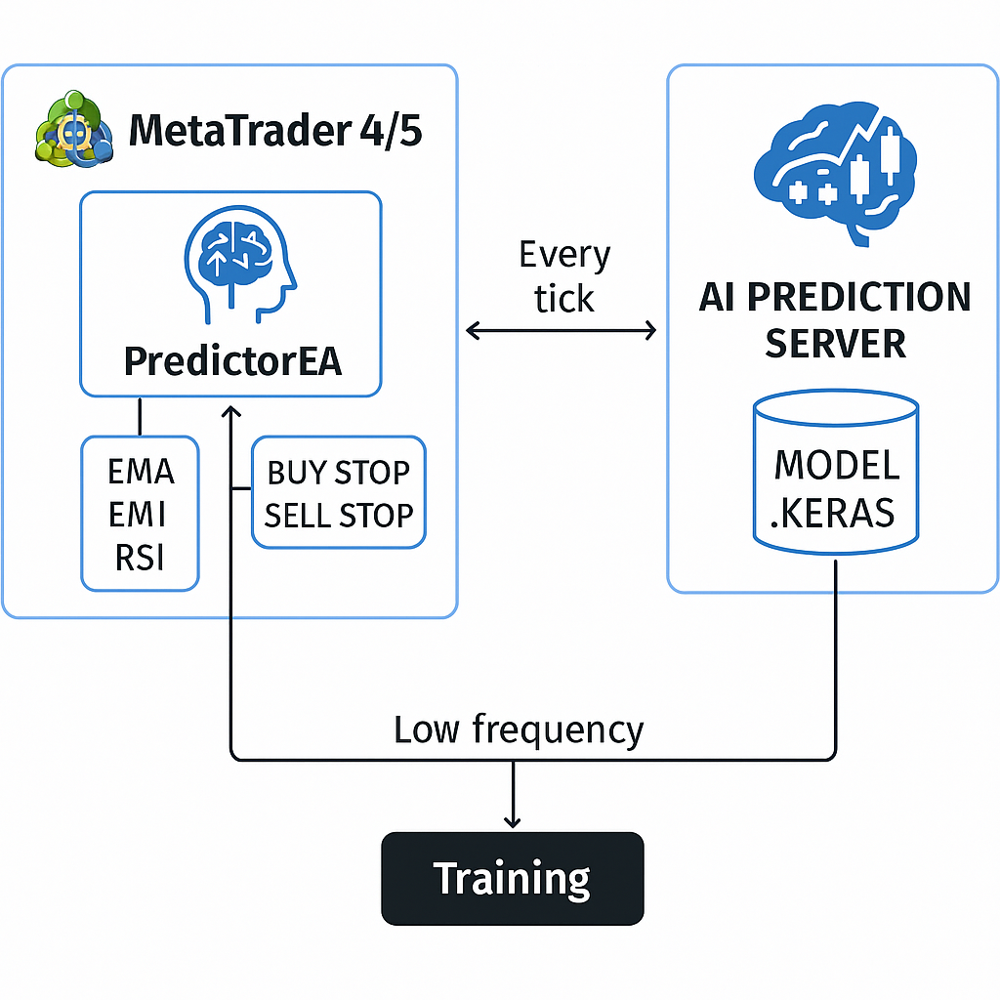
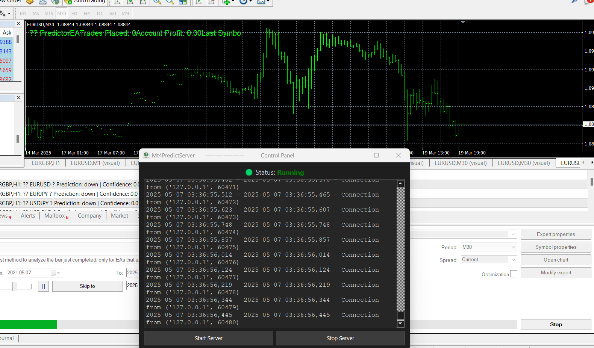

# Mt4PredictServer


🚀 **AI-powered real-time prediction server for MetaTrader 4/5 trading systems**  
This project provides a lightweight Python-based socket server that receives indicator data (EMA, RSI, etc.) from MetaTrader via a C++ DLL, runs a deep learning model, and returns trading signals (`up`, `down`) with confidence scores.

---

## 🔧 Features

- ✅ Real-time TCP server for MT4/MT5 integration
- ✅ Keras deep learning model support
- ✅ DLL-bridge compatible with MQL4
- ✅ Lightweight, production-ready, and fast
- ✅ Pluggable ML pipeline (e.g., scikit-learn, TensorFlow)

# Architechture
 
 

📌 Recommended Confidence Thresholds Based on Strategy
Strategy Type	Recommended Threshold
Scalping	≥ 0.80
Swing Trading	≥ 0.70
Conservative Mode	≥ 0.85
Exploratory / AI Learning Mode	≥ 0.60 with reduced lot size
---


## 📦 Installation

> Requires Python 3.12+

```bash
# Clone the repo
git clone https://github.com/nguemechieu/Mt4PredictServer.git
cd Mt4PredictServer

# Install dependencies
pip install -e .

