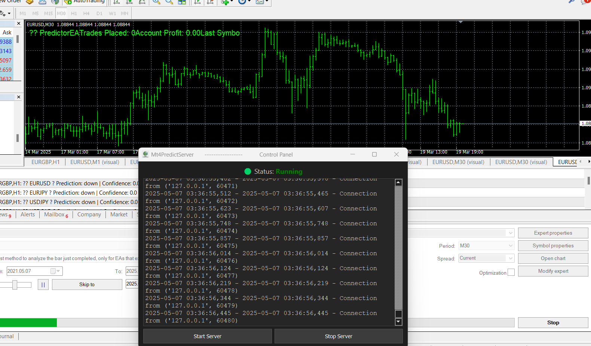
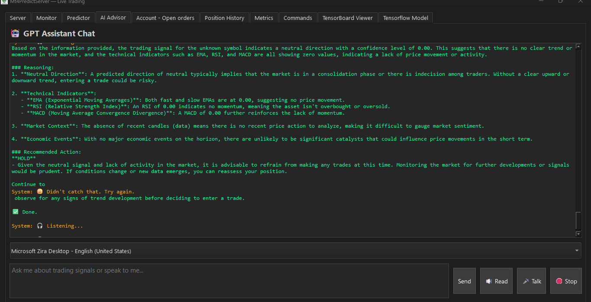

# 🧠 Mt4PredictServer — AI-Powered Trading Intelligence for MetaTrader 4/5


Mt4PredictServer is a real-time AI trading intelligence platform that bridges MetaTrader 4 / 5 with a powerful Python-based prediction engine.
Developed by Noel Martial Nguemechieu, it fuses deep-learning models, GPT-driven reasoning, and autonomous trade execution into a single intelligent system.
---

## 🚀 Overview
Through a secure C++ DLL bridge, Mt4PredictServer streams live market data and technical indicators from MetaTrader into a TensorFlow / Keras or GPT-based AI backend.
The server then generates adaptive trade predictions, automated risk controls, and natural-language market insights — all displayed directly within your MT4 / MT5 dashboard.
---

## 🧩 Architecture


**Core Components**
- **MetaTrader EA (MQL4/MQL5)** → Collects candles, indicators, and sends via DLL socket  
- **PredictBridge.dll (C++)** → Secure TCP client for MT4 ↔ Python communication  
- **PredictServer (Python)** → AI/ML backend: parses data, makes predictions, detects reversals, logs events  
- **Qt Dashboard (PySide6)** → Displays Live Predictions, Account Info, AI Metrics, and GPT analysis  

---

## 🧠 Key Features

| Category | Description |
|-----------|-------------|
| 🔌 Integration | Real-time TCP bridge for MT4/MT5 via C++ DLL |
| 🤖 AI Engine | TensorFlow/Keras or scikit-learn models for trend prediction |
| 🧩 GPTAdvisor | Integrated ChatGPT (OpenAI API) for human-style trade analysis & commentary |
| 📈 Live Prediction Frame | Displays direction, confidence, timestamp, and AI commentary |
| 🔄 Reversal Detection | Detects directional flips (Up→Down / Down→Up) and sends `trade_command` CLOSE signals |
| 🧹 Smart Trade Control | Auto closes or reduces lots when floating loss ≥ 50 % |
| 🧮 Data Buffer | Rolling candle window (up to 1500 bars) with DataFrame support |
| 💬 MT4 Integration | Comment overlays showing predictions & GPT insights |
| 🧾 Logging | Structured logs for server, indicators, and trade events |
| ⚙️ TensorBoard | Built-in training summary and metric visualization tab |

---

## 📊 Confidence Threshold Recommendations

| Strategy Type | Recommended Threshold |
|----------------|------------------------|
| Scalping | ≥ 0.80 |
| Swing Trading | ≥ 0.70 |
| Conservative Mode | ≥ 0.85 |
| Exploratory / AI Learning Mode | ≥ 0.60 (with reduced lot size) |

---

## 💼 Risk & Position Management

- Auto-reduce lots by 50 % when loss ≥ configured threshold (default 50 %)  
- Symbol-specific trade closure (`CloseTradesBySymbol(symbol)`)  
- Reversal-based trade exits (AI signals a directional flip)  
- Optional trailing-stop and stop-loss updates after partial reduction  

---

## 🖥️ User Interface

- **LivePredictionsFrame** — shows all AI-predicted trades with color-coded direction  
- **TensorFlowMetricsTab** — visualizes model performance and training logs  
- **GPTAdvisor Panel** — streams GPT-based natural-language trade insights  
- **ServerControlFrame** — start/stop PredictServer, monitor traffic & resource usage  

Example:
```text
📊 AI Market Prediction
Symbol: AUDJPY
Direction: UP
Confidence: 87.32 %
🧠 Analysis:
Momentum remains bullish with moderate volatility — continuation possible.
````

---

## 📦 Installation

> **Requires Python 3.12 +**

```bash
# Clone repository
git clone https://github.com/nguemechieu/Mt4PredictServer.git
cd Mt4PredictServer

# Install dependencies
pip install -e .
```

---

## 🧠 Optional: Enable GPT Advisor

1. Create an OpenAI API key from [https://platform.openai.com](https://platform.openai.com)
2. Add it to your environment or controller:

   ```python
   self.api_key = "sk-xxxxxxxxxxxxxxxx"
   ```
3. The `GPTAdvisor` module will automatically stream insights in real-time during prediction or log analysis.

---

## ⚙️ Example: EA JSON Message (MT4 → Server)

```json
{
  "type": "candles",
  "symbol": "AUDJPY",
  "candle": {
    "time": 1759938000,
    "open": 100.573,
    "high": 100.604,
    "low": 100.498,
    "close": 100.548,
    "volume": 3857
  },
  "indicators": {
    "rsi": 54.2,
    "ema_fast": 100.56,
    "ema_slow": 100.49,
    "macd": 0.004
  }
}
```

### ⚡ Example Server Response (Server → MT4)

```json
{
  "type": "prediction",
  "status": "ok",
  "symbol": "AUDJPY",
  "prediction": {
    "direction": "up",
    "confidence": 0.86
  },
  "analysis": "Momentum remains strong — potential for breakout continuation.",
  "timestamp": 1759984835.1297994
}
```

---

### 📡 Example Trade Command (AI Reversal)

```json
{
  "type": "trade_command",
  "action": "CLOSE",
  "symbol": "AUDJPY",
  "reason": "Reversal up→down",
  "timestamp": 1759984835.1297994
}
```

---

## 🧰 Tech Stack

| Component  | Technology                                     |
| ---------- | ---------------------------------------------- |
| Backend    | Python 3.12, TensorFlow / Keras / scikit-learn |
| UI         | PySide6 (Qt Widgets)                           |
| Bridge     | C++ (PredictBridge.dll)                        |
| Client     | MQL4 Expert Advisor                            |
| AI Advisor | OpenAI GPT-4o-mini / Offline fallback          |
| Storage    | Pandas DataFrame + CSV cache                   |
| Logging    | Python logging + MT4 console print             |

---

## 🔒 Safety & Stability

* Thread-safe socket access via `std::mutex` (C++)
* Auto-reconnect on network failure
* Graceful shutdown hooks
* Model fallback to offline RSI/EMA logic if prediction fails

---

## 🧪 Testing

```bash
python Mt4PredictServer.py --test
```

Then in MT4:

```
[Expert] MT4PredictServer: Connected successfully
📈 Prediction for AUDJPY → UP (0.87)
```

---

## 📸 Screenshots



---

## 🎬 Demo



---

## 🎥 Video Preview

> ▶️ **Watch Demo Below**
> *(GitHub may show this as a download link — click to view in your browser)*

[](https://github.com/nguemechieu/Mt4PredictServer/raw/main/demo.mp4)

📥 **Download MP4:** [demo.mp4](./demo.mp4)

If hosted externally (e.g. YouTube):

```markdown
https://www.youtube.com/watch?v=XXXXXXXXXXX
```

---

## 🧾 License

**MIT License**
© 2023 – 2026 Noel Martial Nguemechieu
Refactored and maintained by **Sopotek AI Lab**

> “Solutions Powered by Technology — Sopotek AI Lab”

---


